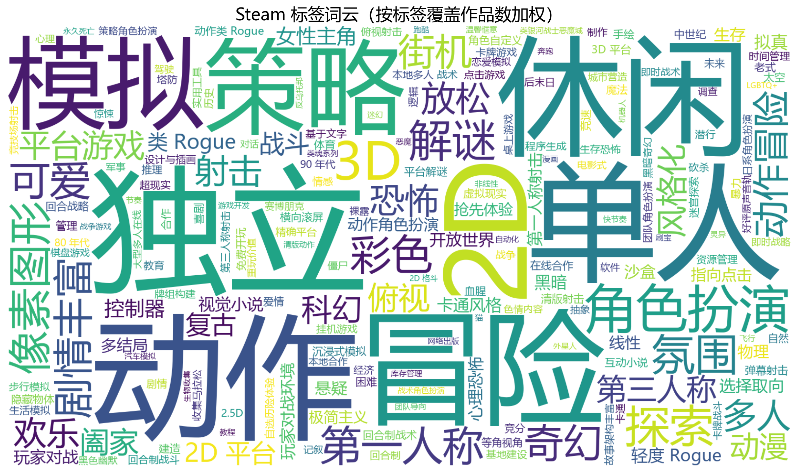
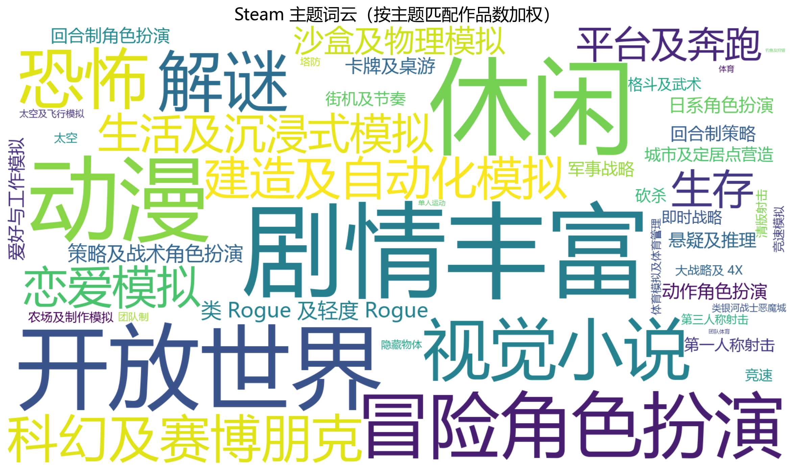
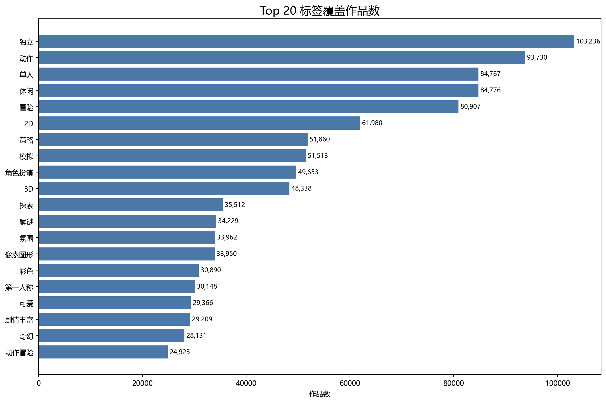
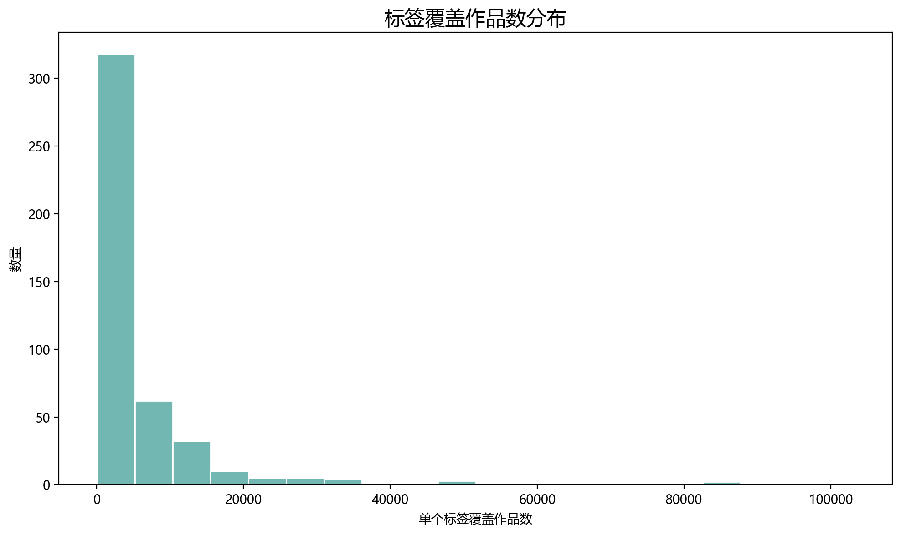
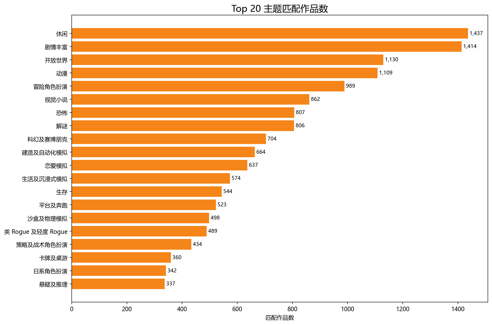
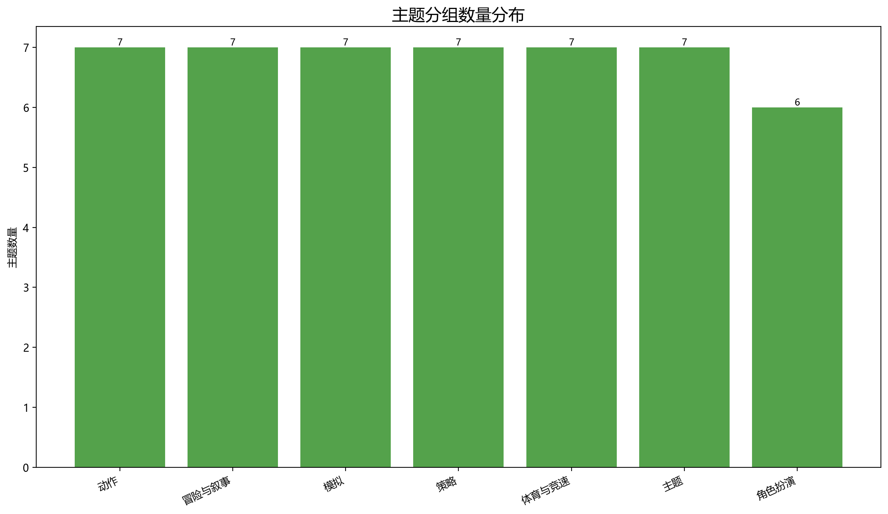
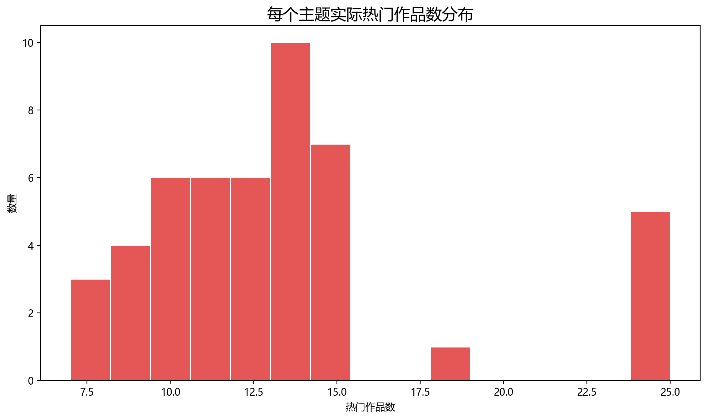
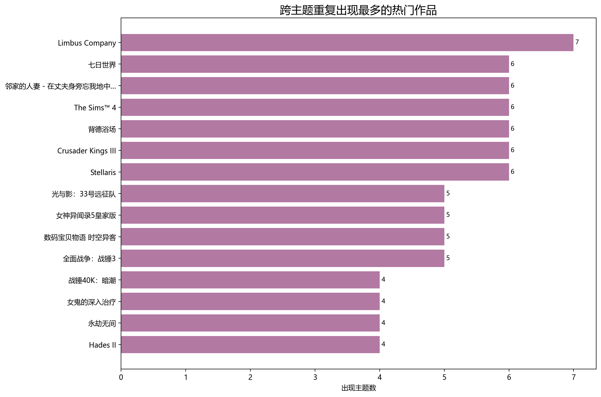

# Steam Game Type Dataset

这个目录是 `steam_game_type` 项目的根目录，包含 Steam 标签与主题数据的抓取脚本、整理脚本，以及最终结果文件。

## 目录结构

### `code/`
- `fetch_steam_tags.py`
  - 抓取 Steam 标签及标签下的代表游戏
- `fetch_steam_topics.py`
  - 抓取 Steam 主题及主题下的热门作品
- `plot_steam_analysis.py`
  - 基于 tags / topics 结果生成词云和统计图
- `organize_and_validate_steam_tags.py`
  - 整理标签结果、生成中文版本和校验报告
- `format_localized_tags_for_review.py`
  - 生成便于人工查看的标签 review 文本
- `retry_failed_steam_topics.py`
  - 对主题抓取中的失败项进行补抓

### `results/latest/`
- `steam_tags_with_top_games.json`
  - 标签完整版结果
- `steam_tags_with_top_games_localized.json`
  - 中文整理版标签结果
- `steam_tags_with_top_games_localized_review.txt`
  - 标签可读文本版
- `steam_topics_with_top_works.json`
  - 主题完整版结果
- `steam_topics_only.json`
  - 主题清单与基础统计
- `plots/`
  - 基于 tags / topics 自动生成的词云和统计图

### `validation/`
- 登录态网页参考文件
- 标签校验报告

说明：
- `validation/` 主要用于人工对照
- 因为登录态与匿名态展示会不同，校验差异不一定代表抓取错误

## 当前数据规模

- 标签：`446`
- 主题：`48`
- 主题结果当前已补齐失败项，`failed_topics = 0`、`failed_works = 0`

## 数据概览分析

### 核心观察

- 标签体系比主题体系细得多：当前共整理出 `446` 个标签，而主题层只有 `48` 个。
- 标签覆盖范围差异很大：按当前抓取结果，覆盖作品数最高的标签是 `独立`，达到 `103,236`；标签覆盖作品数中位数约为 `2,016`，均值约为 `5,941`，说明头部标签非常集中。
- 主题层更像商店导航入口：匹配作品数最高的主题是 `休闲`，为 `1,437`；主题匹配作品数中位数约为 `297`，均值约为 `404`。
- 主题页的热门作品并不总是满 `25` 个：当前中位数约为 `12`，这是 Steam 前台主题页实际返回的结果，不一定代表抓取失败。
- 跨主题重复出现最多的热门作品是 `Limbus Company`，出现在 `7` 个主题中，说明部分头部作品会跨多个主题入口重复曝光。

### 标签词云

下面这张词云按“标签覆盖作品数”加权，字越大，表示该标签覆盖的 Steam 作品越多。

### 主题词云

下面这张词云按“主题匹配作品数”加权，更适合观察 Steam 商店主题导航层的整体分布。

### 标签统计图

Top 20 标签覆盖作品数：

标签覆盖作品数分布：

### 主题统计图

Top 20 主题匹配作品数：

主题分组数量分布：

每个主题实际热门作品数分布：

跨主题重复出现最多的热门作品：

## 数据来源

### 标签数据
- `https://store.steampowered.com/tag/browse/`
- `https://store.steampowered.com/tagdata/gettaggames/...`

### 主题数据
- `https://store.steampowered.com/contenthub/ajaxgetcontenthubdata`
- `https://store.steampowered.com/saleaction/ajaxgetsaledynamicappquery`
- `https://store.steampowered.com/api/appdetails`

## 抓取口径

- 默认语言：`schinese`
- 默认地区：`HK`
- 默认使用未登录匿名态
- 结果更接近 Steam 商店前台公开可见内容

## 说明

- `tag` 是更细粒度的标签体系
- `topic/category` 是更粗粒度的商店主题体系
- 某些主题页返回的热门作品可能少于 25，这通常是前台接口当前返回量导致的，不一定是抓取失败
